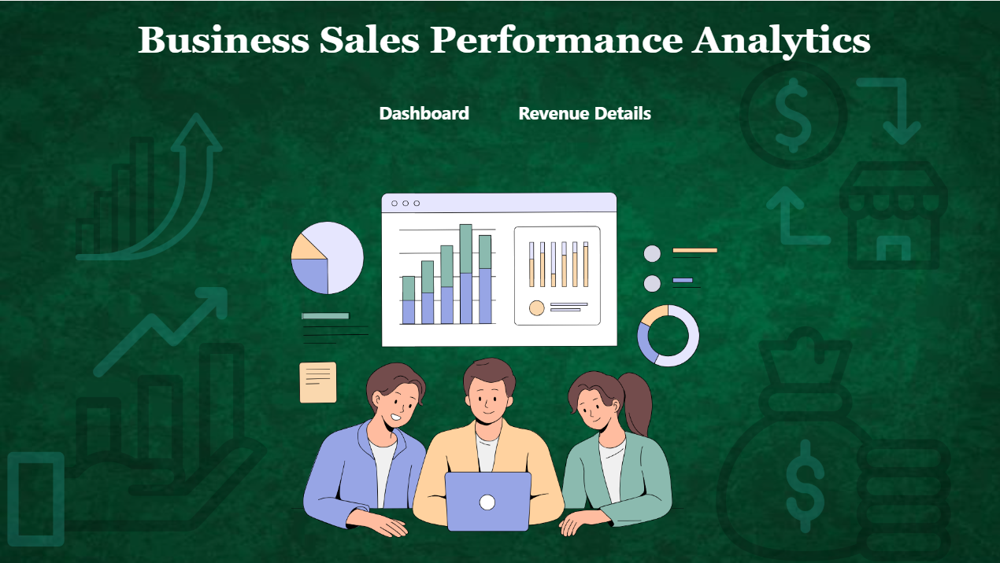
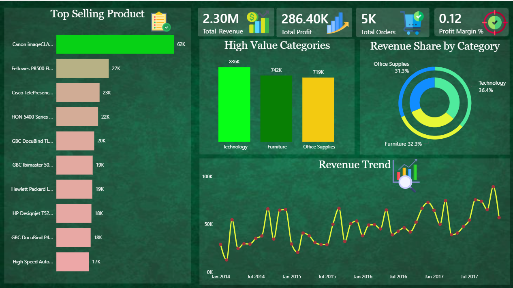
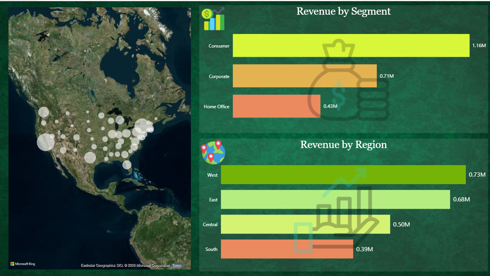

# -FUTURE_DS_01

# 📊 Business Sales Performance Dashboard – Power BI Project

## 📌 Project Overview

This project presents an interactive **Sales Performance Dashboard** built using Microsoft Power BI and the Sample Superstore dataset.

The dashboard transforms raw transactional sales data into meaningful business insights, enabling data-driven decision-making through interactive visualizations and DAX-based calculations.

---

## 🎯 Business Objective

The goal of this project is to:

- Track revenue growth over time
- Identify top-selling products
- Analyze high-value product categories
- Evaluate regional performance
- Monitor overall profitability and margin

---

## 📈 Key Insights Delivered

### 🔹 Revenue Trends
Monthly revenue trend analysis to understand seasonality and business growth patterns.

### 🔹 Top-Selling Products
Top 10 products ranked by total revenue using Top N filtering.

### 🔹 High-Value Categories
Category-wise revenue contribution with profit insights via tooltips.

### 🔹 Regional Performance
Geographical analysis of sales performance to identify strong and underperforming regions.

### 🔹 KPI Summary
- Total Revenue
- Total Profit
- Total Orders
- Profit Margin %

-----
## 🛠 Tools & Technologies Used

- Microsoft Power BI Desktop
- Microsoft Fabric / Power BI Service
- DAX (Data Analysis Expressions)
- Power Query (ETL & Data Cleaning)
- CSV Dataset (Sample Superstore)

----

## 📊 Dashboard Features

- Interactive visuals
- Drill-down hierarchy (Year → Month)
- Top 10 filtering
- Dynamic tooltips
- Executive-style layout
- Cloud publishing via Power BI Service
---------

## 📌 Learning Outcomes

This project enhanced my skills in:

- Data transformation and cleaning
- Writing optimized DAX measures
- Designing professional dashboards
- Implementing time intelligence analysis
- Publishing and sharing reports in the cloud

------------
## 🛠 Tools Used
- Power BI Desktop
- DAX (Data Analysis Expressions)
- Data Visualization Best Practices

---

## 📷 images

---

## 👩‍💻 Author
Lavanya Rayudu
